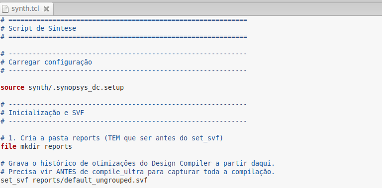
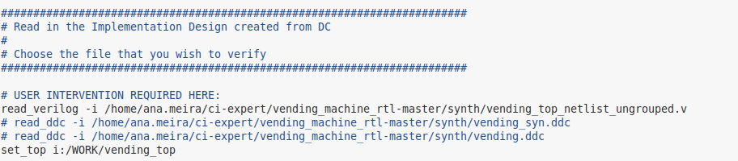
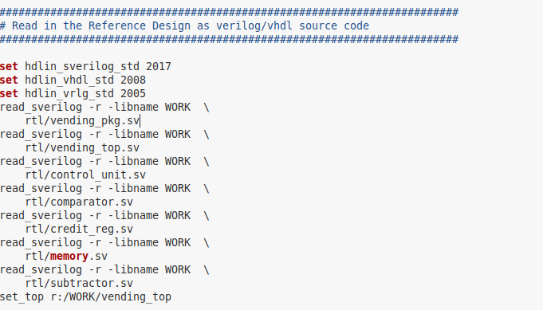
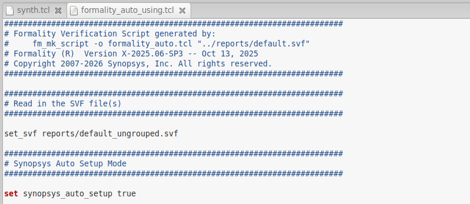

# Vending Machine em SystemVerilog


## Relatório Técnico: Equivalência Formal (Formality) com Guidance de SVF

### 1. Configuração do Ambiente e Geração do SVF

O arquivo SVF (Setup/Verification File) é um arquivo binário que registra, passo a passo, as transformações e decisões de uma sessão de ferramenta da Synopsys. A configuração do fluxo foi estabelecida com sucesso:

* **Geração do SVF de guidance na síntese:** O script `synth.tcl` foi atualizado com a instrução `set_svf` inserida imediatamente antes do comando `compile_ultra`. O arquivo de guidance `reports/default.svf` foi gerado e corresponde exatamente à mesma rodada que gerou a netlist utilizada. *(Conforme evidenciado nas imagens de log do terminal).*



* **Ambiente Formality configurado:** O script `formality.tcl` foi executado sem erros fatais. A biblioteca de células, o arquivo SVF e os designs golden (referência) e revision (implementação) foram carregados na ordem correta.


* **Setup automático:** O comando `set synopsys_auto_setup true` está presente no script logo após o carregamento do `set_svf`. Essa variável é essencial, pois sem ela o Formality aproveita o guidance apenas parcialmente e não consome efetivamente o histórico de otimizações do Design Compiler durante o match.





### 2. Match e Uso do Guidance do SVF

O processo de Match executa o casamento de pontos de comparação, onde o Formality tenta associar cada ponto (como flip-flops e saídas primárias) do golden design com um correspondente no design revisado. Esta etapa foi executada com sucesso e total eficácia em ambas as rodadas.

* **Match Executado:** O Formality conseguiu mapear 86 pontos de comparação (Compare Points) em ambas as sínteses. Os pontos consistem predominantemente em registradores (DFFs) associados aos submódulos (como `control`, `credit_module`, `memory_module`) e às portas de saída (Ports). O Formality utiliza o guidance do SVF para realizar esse casamento estrutural e lógico.


* **Análise do `report_svf_operation`:** O arquivo SVF provou ser vital para guiar o Formality, listando quais operações do guidance foram aplicadas com sucesso. Todas as operações listadas no log foram aceitas (`status accepted`), o que significa que o Design Compiler documentou perfeitamente as otimizações. Na rodada com `-no_autoungroup`, 70 operações foram aceitas. Na rodada com auto-ungroup, 75 operações foram aceitas. Não houve operações rejeitadas, o que indica que não restou trabalho manual significativo a ser realizado.


* **Investigação de Unmatched Points:** O relatório `unmatched_points` retornou vazio (0 pontos não casados) em ambas as execuções. Graças ao uso do SVF, não houve pontos órfãos. Não foi necessária nenhuma investigação manual ou criação de regras de casamento customizadas, comprovando que o guidance foi perfeitamente interpretado pela ferramenta, e demonstrando que não existem pontos golden ou revised sem correspondente.


### 3. Verify e Sign-off da Netlist Principal

A etapa de Verify é responsável por provar se a lógica combinacional entre cada par de pontos casados é logicamente equivalente.

* **Status do Verify:** O relatório de status aponta conclusivamente que a verificação obteve sucesso, alcançando o status final **SUCCEEDED**. O veredito SUCCEEDED significa que todos os pontos casados foram provados equivalentes. Além disso, indica que não há pontos "NOT COMPARED" relevantes que estejam sem justificativa.


* **Análise dos Compare Points:** Dos 86 pontos mapeados, o verificador validou 78 *Passing compare points*. Os 8 pontos restantes geralmente correspondem a nós otimizados ou constantes documentados pelo SVF, que não requerem uma prova de transição ativa, mas estão consistentes.
* **Investigação de Failing Points:** O relatório `failing_points` indicou 0 falhas, confirmando que nenhum par de pontos casados é logicamente diferente. Isso significa que a funcionalidade lógica das portas e registradores não foi quebrada durante a síntese.


* **Conclusão de Sign-off:** Como a equivalência foi provada matematicamente para 100% do circuito, a netlist gerada está apta para a próxima etapa do fluxo, atestando a aprovação do sign-off.


### 4. Comparação: `-no_autoungroup` vs. Auto-ungroup

Para avaliar o comportamento das ferramentas, foram executadas duas rodadas completas, cada uma com o seu próprio arquivo SVF correspondente, dado que otimizações diferentes requerem históricos de guidance distintos.

A análise comparativa entre manter a hierarquia e permitir o achatamento (*flattening*) do design revela como o Design Compiler trabalha as otimizações e como o Formality as rastreia.

### 4.1 Compare Points e Unmatched Points (Resultados Lógicos)

Temos os exatos mesmos números nas duas rodadas: 78 passando e 0 sem casar. Isso significa que independentemente de o Design Compiler manter o seu código dividido em blocos separados (hierarquia) ou se ele juntou tudo em um circuito gigante (*ungrouped*), a funcionalidade dos seus flip-flops e portas lógicas não foi alterada. O Formality conseguiu provar matematicamente que o circuito final é logicamente idêntico ao RTL de referência para qualquer entrada possível.

#### 4.2 Diferenças nas Operações do SVF

A única diferença real entre as rodadas está no arquivo `.svf`. O modo auto-ungroup (padrão) exigiu 5 operações a mais (75 operações aceitas contra 70 da rodada `-no_autoungroup`). Ao inspecionar o log da segunda rodada, vemos exatamente quais foram essas operações extras:

* `guide_ungroup -cells { control }`
* `guide_ungroup -cells { credit_module }`
* `guide_ungroup -cells { comparator_module }`
* `guide_ungroup -cells { memory_module }`
* `guide_ungroup -cells { subtractor_module }`

O Design Compiler enviou essas 5 mensagens extras avisando ao Formality que as barreiras físicas desses módulos foram dissolvidas e fundidas ao top-level.

#### 4.3 O Impacto da Hierarquia na Verificação Formal

* **Hierarquia Preservada (`-no_autoungroup`):** Quando a síntese é executada com esta restrição, o Design Compiler é forçado a respeitar as fronteiras dos submódulos originais. O uso de hierarquia preservada tende a gerar um SVF mais simples. Adicionalmente, isso promove um casamento de pontos mais direto entre o RTL e a netlist. A estrutura do netlist gerado atua quase como um espelho topológico do RTL original.


* **Ungroup Automático (Comportamento Padrão):** Sem a restrição, concede-se liberdade ao sintetizador para aplicar o ungroup automático. O ungroup automático tende a gerar mais transformações que precisam ser registradas no arquivo SVF. Isso ocorre porque o Design Compiler consegue mesclar lógica e otimizar caminhos críticos de forma global. No entanto, mesmo com uma quantidade maior de transformações complexas que alteram a hierarquia e os nomes dos sinais, o guidance fornecido pelo SVF reduz de maneira significativa o trabalho manual. Ele minimiza a necessidade de executar comandos extras como o `match -certain` em comparação com um fluxo que rode sem o auxílio de um SVF. Sem o SVF, a estrutura física seria muito diferente, o que poderia resultar em dezenas de *unmatched points*.

## Descrição

Este projeto implementa uma **máquina de vendas (Vending Machine)** utilizando **SystemVerilog**, modelada por meio de uma **Máquina de Estados Finitos (FSM)**. O sistema simula o funcionamento de uma máquina de vendas automática, permitindo a inserção de moedas, seleção de produtos, validação da compra, liberação do item, devolução de troco e reembolso em caso de cancelamento.

O projeto foi desenvolvido seguindo uma arquitetura modular, separando a unidade de controle do caminho de dados, o que facilita manutenção, testes e reutilização dos componentes.

---

## Funcionalidades

- Inserção de moedas de R$0,25, R$0,50 e R$1,00;
- Acúmulo do crédito do usuário;
- Seleção de um entre quatro produtos;
- Consulta ao preço e ao estoque do produto;
- Verificação de saldo suficiente para compra;
- Liberação do produto quando a compra é válida;
- Atualização automática do estoque;
- Cálculo e devolução do troco;
- Cancelamento da compra com reembolso integral do crédito;
- Sinalização de erro em caso de saldo insuficiente ou produto indisponível.

---

## Máquina de Estados

O funcionamento do sistema é controlado pelos seguintes estados:

- **IDLE** – aguarda inserção de moedas;
- **COLLECT** – acumula o crédito inserido;
- **CHECK** – verifica preço, estoque e saldo disponível;
- **DISPENSE** – libera o produto e atualiza o estoque;
- **CHANGE** – calcula e devolve o troco;
- **ERROR** – informa erro de compra;
- **REFUND** – devolve todo o crédito ao usuário.

---

## Organização do Projeto

```text
.
├── rtl/
│   ├── vending_pkg.sv
│   ├── vending_top.sv
│   ├── control_unit.sv
│   ├── credit_reg.sv
│   ├── memory.sv
│   ├── comparator.sv
│   └── subtractor.sv
│
├── tb/
│   └── tb_vending.sv
│
├── synth/
│   └── synth.tcl
│
└── Makefile
```

---

## Principais módulos

| Módulo | Função |
|---------|--------|
| **vending_top** | Integra todos os módulos do projeto. |
| **control_unit** | Implementa a máquina de estados responsável pelo controle do sistema. |
| **credit_reg** | Armazena e atualiza o crédito acumulado pelo usuário. |
| **memory** | Armazena preço e estoque dos produtos. |
| **comparator** | Verifica se há saldo suficiente e disponibilidade em estoque. |
| **subtractor** | Calcula o valor do troco. |
| **vending_pkg** | Contém definições compartilhadas, como os estados da FSM e funções auxiliares. |

---

# Simulação

O projeto utiliza o simulador **Synopsys VCS** e o visualizador de formas de onda **Verdi**.

## Verificar sintaxe

Compila todos os arquivos RTL e o testbench, realizando apenas a verificação de sintaxe.

```bash
make syntax
```

---

## Compilar

Realiza a compilação completa do projeto.

```bash
make compile
```

---

## Executar a simulação

Compila o projeto (caso necessário) e executa a simulação.

```bash
make run
```

---

## Visualizar as formas de onda

Abre o arquivo de waveform (`vending.fsdb`) utilizando o Verdi.

```bash
make wave
```

---

# Síntese

A síntese lógica é realizada utilizando o **Synopsys Design Compiler**.

```bash
make synth
```

Esse comando executa automaticamente o script:

```text
synth/synth.tcl
```

responsável por:

- leitura do RTL;
- configuração das bibliotecas;
- aplicação das restrições temporais;
- compilação do circuito;
- geração dos relatórios de área, potência e temporização;
- geração do netlist sintetizado.

---

# Limpeza dos arquivos

### Remover arquivos da simulação

```bash
make clean_sim
```

Remove arquivos temporários gerados pelo VCS e pelo Verdi, incluindo:

- executáveis (`simv`);
- diretórios temporários;
- logs;
- arquivos `.fsdb`;
- banco de dados do Verdi.

---

### Remover arquivos da síntese

```bash
make clean_synth
```

Remove arquivos gerados durante a síntese, como:

- netlists sintetizados;
- arquivos `.ddc`;
- relatórios (`.rpt`);
- bibliotecas intermediárias;
- arquivos SVF.

---

### Limpeza completa

```bash
make clean
```

Remove todos os arquivos gerados durante a simulação e a síntese.

---

# Dependências

Para executar todas as funcionalidades do projeto são necessárias as seguintes ferramentas:

- Synopsys VCS
- Synopsys Verdi
- Synopsys Design Compiler

---

# Fluxo de utilização

```text
make syntax
      │
      ▼
make compile
      │
      ▼
make run
      │
      ▼
make wave

ou

make synth
```

---

# Autor
Ana Lívia Meira
Projeto desenvolvido como trabalho da Residencia em microeletronica CI-Expert, utilizando SystemVerilog para modelagem RTL, simulação funcional e síntese lógica.

